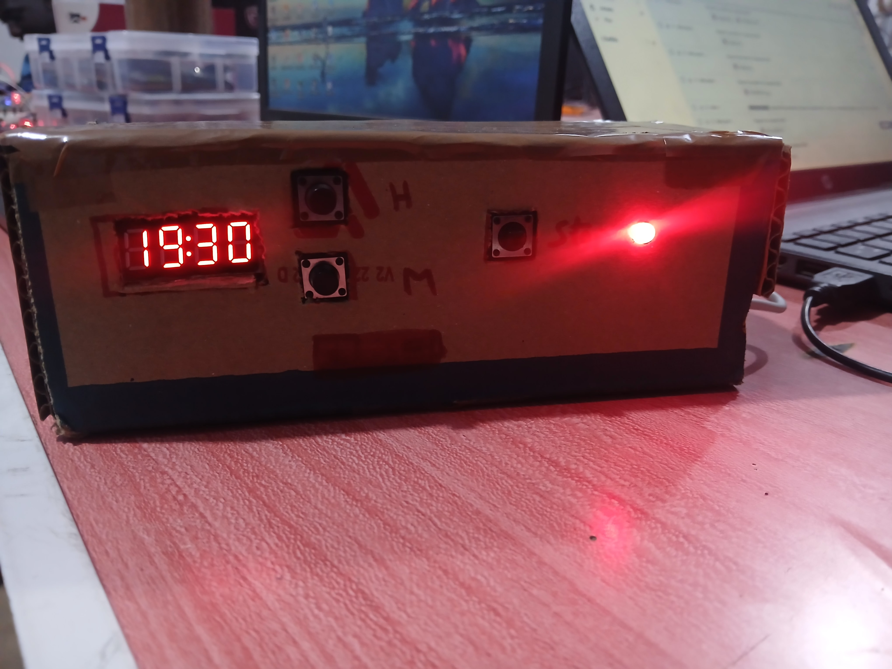

# 🕐 Horloge Alarme Connectée (ESP8266 + NTP)

Réveil connecté basé sur ESP8266, avec synchronisation automatique de l'heure via internet (NTP) et notification à distance si l'alarme n'est pas arrêtée.

## 🎯 Pourquoi ce projet

Un réveil classique doit être réglé manuellement et peut dériver dans le temps. Ici, l'heure se synchronise automatiquement dès que l'appareil a internet, garantissant une précision constante — avec en bonus une notification à distance en cas d'oubli d'arrêter l'alarme.

## ⚙️ Fonctionnalités
- Affichage heure/date sur afficheur TM1637
- Synchronisation NTP automatique, écrite dans le module RTC DS1302 (garde l'heure même sans WiFi)
- Réglage de l'alarme via boutons dédiés (Heure / Minute)
- Arrêt de l'alarme (bouton STOP)
- Buzzer + LED pendant la sonnerie
- **Notification HTTP (webhook)** envoyée automatiquement si l'alarme n'est pas arrêtée — utile pour être alerté à distance

## 🔧 Matériel utilisé
| Composant | Rôle |
|---|---|
| ESP8266 (NodeMCU / Wemos) | Microcontrôleur principal, gère le WiFi |
| RTC DS1302 | Garde l'heure précise même hors tension |
| Afficheur TM1637 (4 digits) | Affichage heure/date |
| Buzzer + LED | Alerte sonore et visuelle |
| 3 boutons | Réglage Heure / Minute / Stop |

## 🔌 Brochage
| Fonction | Pin |
|---|---|
| Afficheur CLK | D1 |
| Afficheur DIO | D2 |
| Bouton Heure | D3 |
| Bouton Minute | D4 |
| Bouton Stop | GPIO3 (RX) |
| RTC RST / CLK / DAT | D7 / D5 / D6 |
| Buzzer | D0 |
| LED rouge | D8 |

## 📁 Fichiers clés
- `src/main.cpp` : logique principale (initialisation, boucle, gestion des alarmes, notifications)

## 🚀 Compilation et téléversement (PlatformIO)
Ouvrir le projet dans VS Code + extension PlatformIO, puis :

\`\`\`bash
# Compiler
platformio run

# Téléverser sur la carte
platformio run --target upload
\`\`\`

## ⚙️ Configuration
- Renseigner `ssid` et `password` dans `src/main.cpp` (idéalement à extraire dans un fichier `config.h` ignoré par git)
- Définir `APP_ID`, `APP_KEY` et `server` dans `src/main.cpp` pour activer les notifications

⚠️ Ne jamais commiter vos identifiants WiFi et clés API dans un dépôt public.

## 🎥 Démo
[Lien vers la vidéo de démonstration](TON_LIEN_YOUTUBE)

## 💡 Améliorations possibles
- Remplacer `delay()` par un debounce non bloquant pour une meilleure réactivité
- Stocker les réglages d'alarme en RAM du RTC ou en SPIFFS pour les conserver après coupure
- Extraire identifiants et clés dans un `config.h.example` (ignoré par `.gitignore`)
- Ajouter la gestion des erreurs réseau et des tentatives de reconnexion

## 🛠️ Dépannage
- Connexion WiFi échoue → vérifier SSID/mot de passe et la portée du signal
- Heure NTP non synchronisée → vérifier la connexion internet et que `configTime()` est bien supporté

---
*Projet réalisé par [ton nom] — étudiant en électrotechnique/systèmes embarqués*
